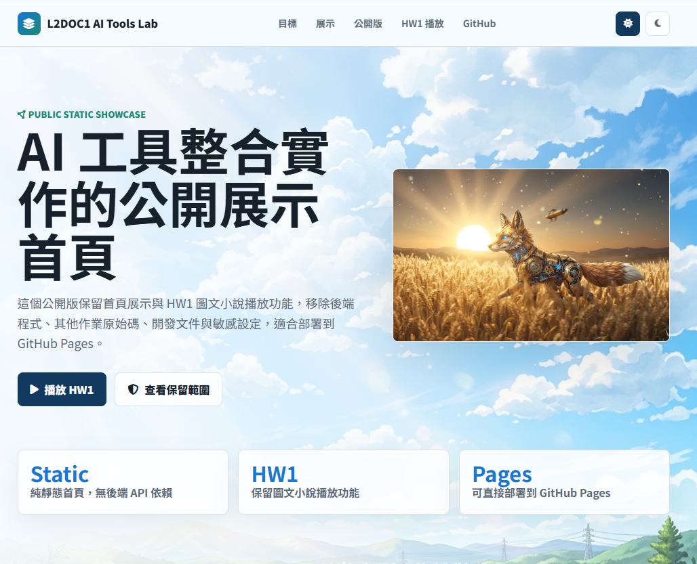

# L2DOC1 AI Tools Lab

這是公開展示版 repository，只保留首頁與 HW1 圖文小說播放功能。

為避免原始碼與開發內容外流，已移除後端程式、其他作業模組、開發文件、提示詞、敏感設定與未使用素材。HW1 只保留靜態播放器與預設故事素材，不包含原本的編輯器與 API 功能。

## Demo

- 首頁 Demo: <https://gshan1209-cell.github.io/L2DOC1-github/>


## 保留內容

- `index.html`: 根目錄導頁，會轉到首頁。
- `static/index.html`: 公開首頁，包含 HW1 播放入口。
- `static/shinkai_bg.png`: 首頁背景圖片。
- `uploads/929ca1fb907446cb858d0cd639c9db68.mp4`: 首頁展示影片。
- `uploads/story1.png` 到 `uploads/story12.png`: HW1 圖文小說故事圖片。
- `HW1/index.html`: HW1 導頁。
- `HW1/indexHw1.html`: HW1 靜態播放器。
- `HW1/default_novel.json`: HW1 預設故事資料。
- `.gitignore`: 基本忽略規則。
- `README.md`: 公開版專案說明。

## 不包含內容

- 後端應用程式與 API 程式碼
- 其他作業模組與編輯器原始碼
- 敏感金鑰、憑證或模型設定
- 開發文件、代理人提示與架構細節
- 測試資料、使用者上傳資料與未使用素材

## 本機瀏覽

首頁:

```text
http://127.0.0.1:8000/
```

HW1 播放器:

```text
http://127.0.0.1:8000/HW1/indexHw1.html
```
